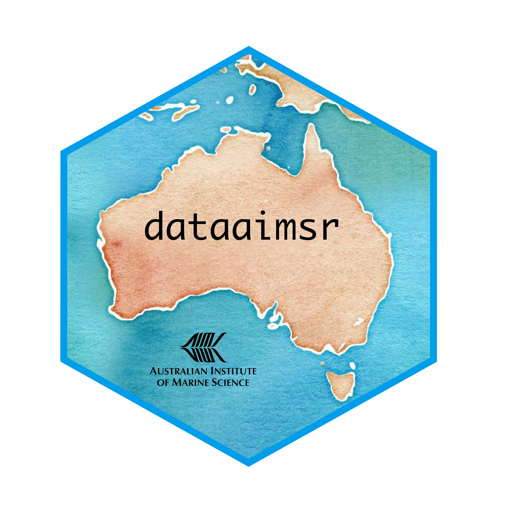

<!-- README.md is generated from README.Rmd. Please edit that file -->

```{r, include = FALSE}
stopifnot(require(knitr))
options(width = 90)
knitr::opts_chunk$set(
  collapse = TRUE,
  comment = "#>",
  fig.path = "man/figures/README-",
  out.width = "100%"
)
```

```{r, echo = FALSE}
version <- as.vector(read.dcf('DESCRIPTION')[, 'Version'])
version <- gsub('-', '.', version)
```



<!-- badges: start -->
[](https://www.tidyverse.org/lifecycle/#maturing)
[](https://github.com/AIMS/data-platform-r/actions)
[](https://choosealicense.com/)
[](commits/master)
<!-- badges: end -->

AIMS Data Platform R Client
==========================

__AIMS Data Platform R Client__ will provide easy access to data sets for R applications to the [AIMS Data Platform API](https://aims.github.io/data-platform).

Usage of AIMS Data Platform API Key
----------------------------------

__AIMS Data Platform__ requires an API Key for requests, [get a key here.](https://aims.github.io/data-platform/key-request)

The API Key can be passed to the package functions as an additional `api_key = 'XXXX'` argument, however it is preferred that API Keys are not stored in code.

If the environment variable `AIMS_DATAPLATFORM_API_KEY` is stored in the user's `.Renviron` file then that will be loaded and used automatically.  In that case the users `.Renviron` file might look like:

```
AIMS_DATAPLATFORM_API_KEY=XXXXXXXXXXXXX

```
The `.Renviron` file is usually stored in each users home directory.

### Possible .Renviron file locations

System        | .Renviron file locations
--------------|-------------------------
MS Windows    | `C:\Users\<username>\.Renviron`  or `C:\Users\<username>\Documents\.Renviron`
Linux / MacOs | `/home/<username>/.Renviron`

Installation
------------

At this stage __AIMS Data Platform R Client__ is not hosted on CRAN R package network.
An alternative method of installation is to use the R `devtools` package.

R `devtools` can be installed using the following command:

```{r, eval = FALSE}
install.packages("devtools")
```

After `devtools` has been installed the __AIMS Data Platform R Client__ can be installed directly
from GitHub using the following command:

```{r, eval = FALSE}
devtools::install_github("https://github.com/AIMS/data-platform-r")
```

This command will also install 2 dependencies `httr` and `jsonlite`.


Available Data Sets
-------------------

The __AIMS Data Platform API__ is a *REST API* providing *JSON* formatted data. Documentation about available data sets can be found on the [AIMS Data Platfom API](https://aims.github.io/data-platform).

Further Information
----------------

Further information about the __AIMS DataPlatform R Client__ and __AIMS DataPlatform API__ can be seen on the [project page](https://aims.github.io/data-platform-r).

This library is provided for use under the Creative Commons by Attribution license ([CC BY 3.0](https://creativecommons.org/licenses/by/3.0/au/legalcode)) by the AIMS Datacentre for the [Austrailian Institute of Marine Science](https://www.aims.gov.au)
