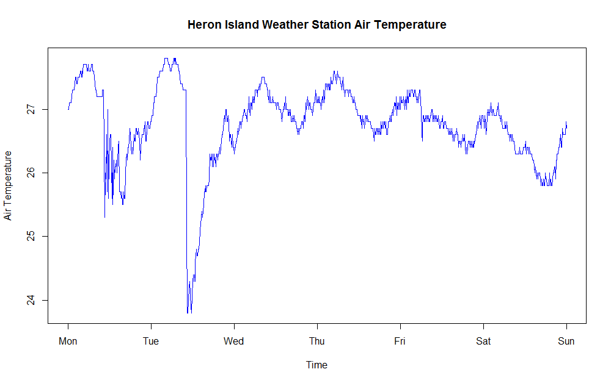

AIMS DataPlatform R Client
==========================

__AIMS DataPlatform R Client__ will provide easy access to data sets for R applications to the [AIMS DataPlatform API](https://aims.github.io/data-platform).

Installation
------------

Details on installation of __AIMS DataPlatform R Client__ are [here](install).

Available Data Sets
-------------------

The __AIMS DataPlatform API__ is a *REST API* providing *JSON* formatted data.  Documentation about available data sets can be found on the [AIMS DataPlatfom API](https://aims.github.io/data-platform)

General Usage Examples
----------------------

A list of functions available can be found using:

```

> help(package="aimsdataplatform")

```
Details on individual functions is available with the normal:

```
> library(aimsdataplaform)
> ?getAllData

```
Examples usage of data request using query filter parameters with R client:

```
> library(aimsdataplatform)

> getData('10.25845/5c09bf93f315d', filters=list(
    'site-name'='Davies Reef',
    'parameter'='Wind Direction (Scalar Average 10 Minutes)'))

# An example where only 10 rows of data is desired...
> getData('10.25845/5c09bf93f315d', filters=list(
    'site-name'='Square Rocks',
    'series'=104939,
    'size'=10))

> getAllData('10.25845/5c09bf93f315d', filters=list(
    'site-name'='Davies Reef'))

```

Example usage of data series download and plot
----------------------------------------------

Suppose we want to query a data series and plot it then the procedure might be:
1. Examine documentation and establish query filters
2. Perform data download using `getAllData`
3. Use R `plot` to create a chart

We decide to query the [AIMS Weather](https://aims.github.io/data-platform/weather) data set based on a data series, then we are guaranteed of getting information from one site for one metric.  Our filters might look like the following:


Variable  | Value        | Description
----------|--------------|------------
series    | 189          | Found [here](https://aims.github.io/data-platform/weather/series), Heron Island Air Temperature data series
from-date | '2018-01-01' | We want to start charting on 1/1/2018
thru-date | '2018-01-07' | We are plotting 7 days of data

Then our query and plot might look like the following:

```
> library(aimsdataplatform)

> results <- getAllData("10.25845/5c09bf93f315d", filters=list(
    'series'=189,
    'from-date'='2018-01-01',
    'thru-date'='2018-01-07'))
[1] "Cite this data as: Australian Institute of Marine Science (AIMS)..."
[1] "Result count: 865"

> plot(results$dataFrame$time, results$dataFrame$qc_value,
    xlab="Time",
    ylab="Air Temperature",
    col="blue", main="Heron Island Weather Station Air Temperature",
    type="l")

```



Detailed Example
----------------

A more detailed example of the R package usage can be seen on the [detailed example](detailed-example.nb.html) page.  This is an [R Studio](https://www.rstudio.com/) Notebook and can be used interactively from *R Studio*.  __Note that you need to have an AIMS DataPlatform API Key available to run this detailed example.__


Usage of AIMS DataPlatform API Key
----------------------------------

__AIMS DataPlatform__ requires an API Key for requests, this can be passed to each function as an additional `apiKey='XXXX'` argument, however it is preferred that API Keys are not stored in code.

If the environment variable `AIMS_DATA_PLATFORM_API_KEY` is stored in the user's `.Renviron` file then that will be loaded and used automatically.  In that case the users `.Renviron` file might look like:

```
AIMS_DATAPLATFORM_API_KEY=XXXXXXXXXXXXX

```
The `.Renviron` file is usually stored in each users home directory.

### Possible .Renviron file locations

System     | .Renviron file locations
-----------|-------------------------
MS Windows | `C:\Users\<username>\.Renviron`  or `C:\Users\<username>\Documents\.Renviron`
Linux      | `/home/<username>/.Renviron`

API Keys can be obtained from the [AIMS DataPlatform project page](https://aims.github.io/data-platform)
