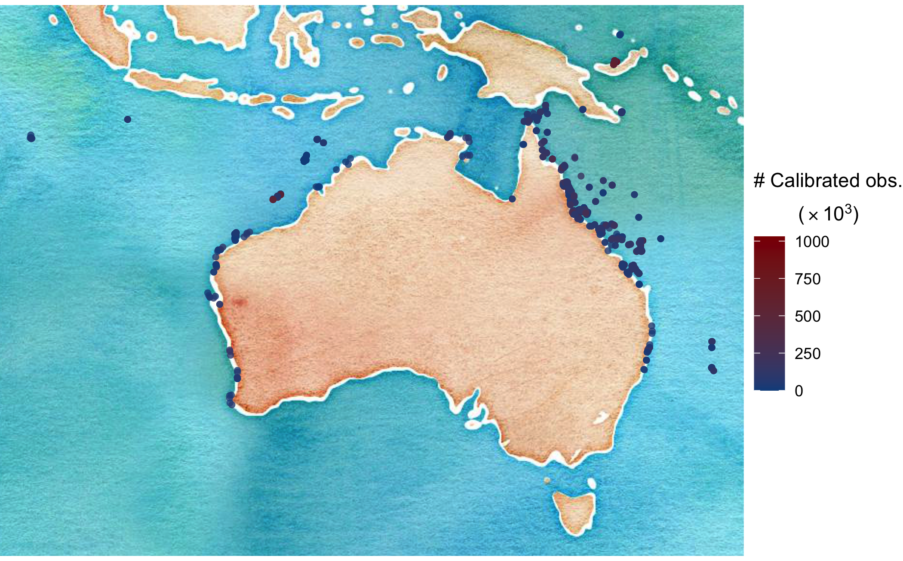
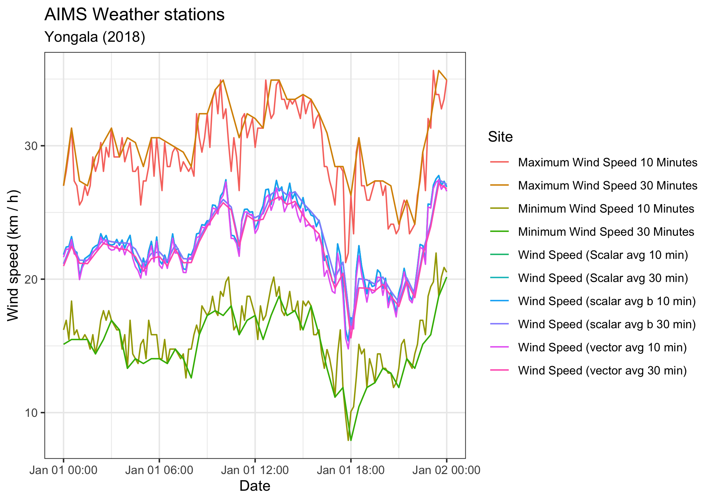
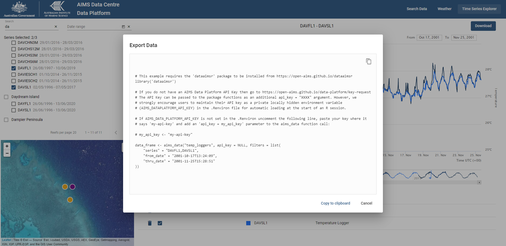

# Summary

`dataaimsr` is an **R package** written to provide open access to decades
of field measurements of atmospheric and oceanographic parameters around the
coast of Australia, conducted by the
[Australian Institute of Marine Science][0] (AIMS). The package communicates
with the recently-developed AIMS Data Platform API via an API key. Here we
describe the available datasets as well as example usage cases.

[0]: https://www.aims.gov.au/

# Statement of Need

The Australian Institute of Marine Science (AIMS) has a long tradition in
measuring and monitoring a series of environmental parameters along the
tropical coast of Australia. These parameters include long-term record of sea
surface temperature, wind characteristics, atmospheric temperature, pressure,
chlorophyll-a data, among many others. The AIMS Data Centre team has recently
developed the [AIMS Data Platform API][1] which is a *REST API* providing
JSON-formatted data to users. `dataaimsr` is an **R package** written to
allow users to communicate with the AIMS Data Platform API using an API key
and a few convenience functions to interrogate and understand the datasets
that are available to download. In doing so, it allows the user to
fully explore these datasets in R in whichever capacity they want (e.g.
data visualisation, statistical analyses, etc). The package itself contains
a `plot` method which allows the user to plot summaries of the different types
of dataset made available by the API.

[1]: https://open-aims.github.io/data-platform/

Currently, there are two AIMS long-term monitoring datasets available to be
downloaded through `dataaimsr`: 1) the Northern Australia Automated Marine
Weather And Oceanographic Stations---a list of the weather stations which have
been deployed by AIMS and the period of time for which data may be available
can be found on the [AIMS metadata][2] webpage; 2) AIMS Sea Water Temperature Observing System (AIMS Temperature Logger Program)---for more information on
the dataset and its usage, please visit the [AIMS metadata][3] webpage.

[2]: https://apps.aims.gov.au/metadata/view/0887cb5b-b443-4e08-a169-038208109466

[3]: https://apps.aims.gov.au/metadata/view/4a12a8c0-c573-11dc-b99b-00008a07204e 

# Technical details and Usage

Before loading the package, a user needs to download and store their personal
[AIMS Data Platform API Key][4]---we strongly encourage users to
maintain their API key as a private, locally hidden environment variable
(`AIMS_DATAPLATFORM_API_KEY`) in the `.Renviron` file for
automatic loading at the start of an R session.

[4]: https://open-aims.github.io/data-platform/key-request

`dataaimsr` imports the packages *httr* [@httrcit], *jsonlite* [@jsonlitecit],
*parsedate* [@parsedatecit], *dplyr* [@dplyrcit], *tidyr* [@tidyrcit],
*rnaturalearth* [@rnaturalearthcit], *sf* [@sfcit], *ggplot2* [@ggplot2cit],
*ggrepel* [@ggrepelcit] and *curl* [@curlcit].

The [Weather Station][2] and [Sea Water Temperature Loggers][3] datasets are
very large (terabytes in size), and as such they are not locally stored.
They are instead downloaded via the API and unique DOI identifiers. The 
datasets are structured by sites, series and parameters. A series is a 
continuing time-series, i.e. a collection of deployments measuring the 
same parameter (e.g. Air Temperature, Air Pressure, Chlorophyll) at the 
same subsite. So, for a given site and parameter, there might exist multiple
subsites and therefore series, in which case they are most likely 
distinguishable by depth.

For the Sea Water Temperature Loggers dataset, series is synonymous 
with the variable called subsite. For the Weather Station dataset, it 
is the combination of subsite and parameter.

## Discover a dataset

The [AIMS Data Platform API][1] points to the full metadata of each
dataset. We are currently working on ways to facilitate the 
visualisation of both datasets and their multiple features directly
through the R package. So please consult our [on-line vignettes][35] to obtain
the most up-to-date instructions on how to navigate the different datasets.
Future versions of this package might even provide more of AIMS monitoring
datasets.

[35]: https://docs.ropensci.org/dataaimsr/articles/

### Data summaries

The first step would be to visualise the dataset. We do this by
mapping all available sites. For example, we download the summary information
for the Sea Water Temperature Loggers dataset using the main function called
`aims_data`. Setting the argument `api_key = NULL` means that `dataaimsr` will
automatically search for the user's API key stored in `.Renviron`.
The `summary` argument should only be used when the
user wants an overview of the available data---this is currently
implemented for the Sea Water Temperature Loggers dataset only. One can
visualise `summary-by-series` or `summary-by-deployment`. The output of
`aims_data` is a `data.frame` of class `aimsdf` with its own plotting
method \autoref{fig:summary}:

```{r, echo = FALSE, message = FALSE, warning = FALSE}
library(dataaimsr)
sdata <- aims_data("temp_loggers", api_key = NULL,
                   summary = "summary-by-series")
```

```{r echo = FALSE, eval = FALSE}
library(dataaimsr)
sdata <- aims_data("temp_loggers", api_key = NULL,
                   summary = "summary-by-series")
out <- plot(sdata, ptype = "map")
ggsave("paper/summary.png", out, width = 7, height = 4.36, units = "in",
       device = "png", dpi = 300)
```



For summary data such as `sdata`, plot will always generate a map with the
points around Australia and associated regions, coloured by the number of
calibrated observations.
Observations in a series can be: `uncal_obs`, `cal_obs` and `qc_obs`, which 
respectively stand for uncalibrated, calibrated, and quality-controlled 
observations. Calibrated and quality-controlled are generally the same.
Instruments are routinely calibrated (mostly once a year) in a
temperature-controlled water bath and corrections applied to the data. After
calibration, all data records are quality controlled based on the following
tests: 1) clip to in-water only data, using deployment's metadata, 2)
impossible value check: data outside a fixed temperature range (14˚C – 40˚C)
is flagged as bad data, 3) spike test: individual extreme values are flagged
as probably bad according to the algorithm presented in @morelo2014methods and
4) Excessive gradient test: pairs of data that present a sudden change in the
slope are flagged as probably bad [@toma2016acta]. If any data record fails at
least one of the tests, a QC flag equal to 2 is returned, otherwise, the QC
flag is set to 1. Please refer to our on-line [on-line vignettes][35] to learn
details about the entire structure of an `aimsdf` object.

In the case of the Weather Station dataset, the user can call a
the `aims_filter_values` function which allows one to query what
sites, series and parameters are available for both datasets:

```{r, message = FALSE, warning = FALSE}
head(aims_filter_values("weather", filter_name = "series"))
```

The downside is that one cannot know what time window is available
for each one of those, nor how they are nested (i.e. series /
parameter / site). In a way though the series name generally
gives that information anyway (see code output above). If knowing the 
available observation window is absolutely crucial, then as mentioned 
above the user should refer to the [on-line metadata][3].

## Download slices of datasets

We recommend slicing the datasets because AIMS monitoring datasets are of very 
high temporal resolution and if one tries to download an entire series
it might take a few hours. To slice the datasets properly, the user
needs to apply filters to their query.

### Data filters

Filters are the last important information the user needs to know to 
master the navigation and download of AIMS monitoring datasets. Each 
dataset can filtered by attributes which can be exposed with the function
`aims_expose_attributes`:

```{r, message = FALSE, warning = FALSE}
aims_expose_attributes("weather")
aims_expose_attributes("temp_loggers")
```

The help file (see `?aims_expose_attributes`) contains the details about what
each filter targets. So, having an understanding of the summaries and what
filters are available provide the user with a great head start.

Downloading the data is achieved using the same `aims_data` function, 
however now the `summary` argument is omitted, and instead 
implement filters. For example, to download all the data collected at the
[Yongala wreck][6] for a specific time window:

[6]: https://en.wikipedia.org/wiki/SS_Yongala

```{r, message = FALSE, warning = FALSE}
wdata_a <- aims_data("weather", api_key = NULL,
                     filters = list(site = "Yongala",
                                    from_date = "2018-01-01",
                                    thru_date = "2018-01-02"))
```

The returned `aimsdf` object in this case has attributes which give us
summary crucial information:

- `metadata` a doi link containing the metadata record for the data series

- `citation` the citation information for the particular dataset

- `parameters` an output `data.frame`

These can be directly extracted using the convenience functions
`aims_metadata`, `aims_citation` and `aims_parameters`, e.g.:

```{r}
aims_metadata(wdata_a)
```

This example data contains multiple parameters available for this site at the
specified time, and the actual measurements are either raw or
quality-controlled. For monitoring data (i.e. when `summary = NA` in a
`aims_data` call), we can either visualise the data as a time series broken
down by parameter, or a map showing the sites with some summary info. If the
parameters are not specified, then `dataaimsr` will plot a maximum of 4
parameters chosen at random for a time series plot. Alternatively the user can
specify which parameters are to be plotted \autoref{fig:wind}.

```{r echo = FALSE, eval = FALSE}
# check parameters with aims_parameters(wdata_a)
out <- plot(wdata_a, ptype = "time_series",
            pars = c("Water Pressure", "Chlorophyll"))
ggsave("paper/wind.png", out, width = 8.5, height = 3.9, units = "in",
       device = "png", dpi = 300)
```



The filters `from_date` and `thru_date` can be further refined by including a
time window to download the data:

```{r, message = FALSE, warning = FALSE}
wdata_b <- aims_data("weather", api_key = NULL,
                     filters = list(series_id = 64,
                                    from_date = "1991-10-18T06:00:00",
                                    thru_date = "1991-10-18T12:00:00"))
range(wdata_b$time)
```

### Methods

Objects of class `aimsdf` have associated `plot`, `print` and `summary`
methods.

### Data citation

Whenever using `dataaimsr`, we ask the user to not only cite this paper, but
also any data used in an eventual publication. Citation data can be extracted
from a dataset using the function `aims_citation`:

```{r, message = FALSE, warning = FALSE}
aims_citation(wdata_b)
```

## Sister web tool

The Time Series Explorer (https://apps.aims.gov.au/ts-explorer/) is an
interactive web-based application that visualises large time series datasets.
The application utilises the AIMS Data Platform API to dynamically query data
according to user selection and visualise the data as line graphs. Series are
able to be compared visually. For large series, data are aggregated to daily
averages and displayed as minimum, maximum and mean. When the user 'zooms in'
sufficiently, the data will be displayed as non-aggregate values
\autoref{fig:tssa}. This technique is being used to ensure the application
performs well with large time series.


The user can then download the displayed data as CSV or obtain a R code
snippet that shows how to obtain the data using the dataaimsr package
\autoref{fig:tssb}. In this way, a user can easily explore and discover
datasets and then quickly and easily have this data in their R environment for
additional analysis.



# Future directions

The API is still a work in progress. We are working on ways to better
facilitate data visualisation and retrieval, and also we are trying to
standardise the outputs from the different datasets as much as possible. In the
future, we envision that `dataaimsr` will also provide access to other
monitoring datasets collected by AIMS.

# References
