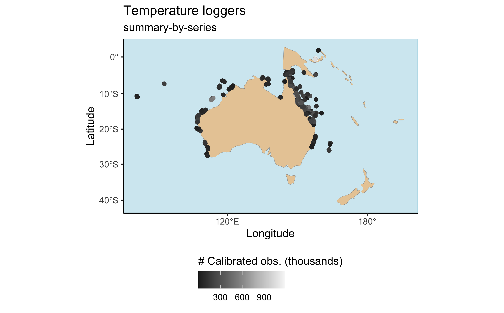
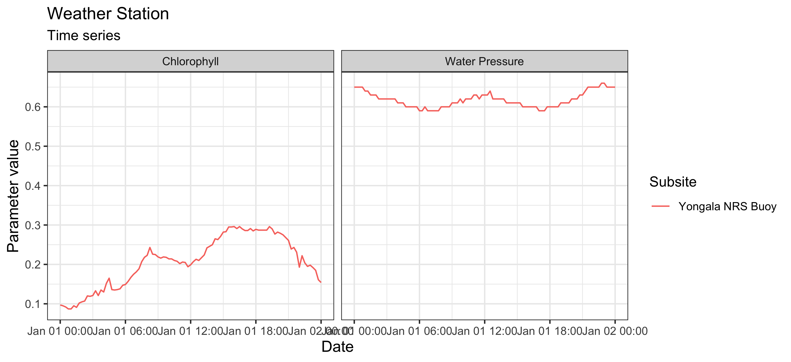

The very first thing to do is read the documentation on our
[README](../index.html) page. Make sure you have the package properly 
installed, and that your personal [AIMS Data Platform API Key][1] has 
been downloaded.

[0]: https://www.aims.gov.au/
[1]: https://open-aims.github.io/data-platform/key-request

As per the installation instructions, we strongly suggest that you hide your
API Key permanently in your `.Renviron` file and set the object `my_api_key` to
`NULL` in the chunk below. You can read more about why that is important
[here](https://CRAN.R-project.org/package=httr/vignettes/secrets.html).


```r
# set my_api_key to NULL after successfully placing it in .Renviron
my_api_key <- NULL
```

We now load `dataaimsr`:


```r
library(dataaimsr)
```

## How this package works

`dataaimsr` contains two sets of monitoring data collected by AIMS---[the
Australian Institute of Marine Science][0]---since the 1980's: the
[Weather Station][2] dataset which contains 
encompasses data for different parameters (e.g. Air Temperature, Air 
Pressure, Chlorophyll, and many others); and the
[Sea Water Temperature Loggers][3] dataset which contains records of 
(you guessed it!) sea water temperature at different sites and water 
depths.

[2]: https://doi.org/10.25845/5c09bf93f315d
[3]: https://doi.org/10.25845/5b4eb0f9bb848

The datasets are very large, and as such they are not locally stored.
They are instead downloaded via the API and unique DOI identifier (just 
hover over the data links above to see the actual DOI codes). The 
datasets are structured by sites, series and parameters. A series is a 
continuing time-series, i.e. a collection of deployments measuring the 
same parameter (e.g. Air Temperature, Air Pressure, Chlorophyll) at the 
same subsite. So, for a given site and parameter, there might exist multiple
subsites and therefore series, in which case they are most likely 
distinguishable by depth.

For the Sea Water Temperature Loggers dataset, series is synonymous 
with the variable called subsite. For the Weather Station dataset, it 
is the combination of subsite and parameter.

This vignette gives an overview of how one would go about discovering
the overall information contained in the datasets. For dataset-specific 
vignettes, see our other [vignette pages][4].

[4]: https://ropensci.github.io/dataaimsr/articles/

## Discover a dataset

The [AIMS Data Platform API][5] points to the full metadata of each
dataset. We are currently working on ways to facilitate the 
visualisation of both datasets and their multiple features directly
through the R package. At the moment though it is only possible
to visualise summary information for the Sea Water Temperature Loggers
dataset. A similar feature for the Weather Station dataset will be 
implemented in the near future (likely early 2021)---so for now, please
refer to the online metadata to discover from where (and when) you can 
download data.

[5]: https://open-aims.github.io/data-platform/

### Data summary

The first step would be to visualise the dataset. Let's do this by
mapping all available sites for the Sea Water Temperature 
Loggers dataset using the main function called `aims_data`:


```r
sdata <- aims_data(target = "temp_loggers", api_key = my_api_key,
                   summary = "summary-by-series")
head(sdata)
#>   site_id                    site subsite_id    subsite series_id     series         parameter
#> 1       1 Agincourt Reef Number 3       2687     AG3FL1      2687     AG3FL1 Water Temperature
#> 2       1 Agincourt Reef Number 3      14276  AG3SL1old     14276  AG3SL1old Water Temperature
#> 3       3           Cleveland Bay       3007 CLEVAWSSL1      3007 CLEVAWSSL1 Water Temperature
#> 4       3           Cleveland Bay       3069 CLEVAWSFL1      3069 CLEVAWSFL1 Water Temperature
#> 5       4             Davies Reef       2629     DAVFL1      2629     DAVFL1 Water Temperature
#> 6       4             Davies Reef       2630     DAVSL1      2630     DAVSL1 Water Temperature
#>   parameter_id time_coverage_start time_coverage_end      lat      lon depth uncal_obs cal_obs
#> 1            1          1996-03-30        2008-12-11 -15.9903 145.8212     0     23130  110480
#> 2            1          1996-03-30        2011-07-21 -15.9905 145.8213     5    114450  216794
#> 3            1          2004-05-13        2008-05-03 -19.1557 146.8813     7     11951   53231
#> 4            1          2005-09-15        2005-12-22 -19.1557 146.8813     1         0    4656
#> 5            1          1997-08-26        2019-06-10 -18.8065 147.6688     1    437544  566585
#> 6            1          1996-05-02        2022-03-05 -18.8060 147.6686     8    512106  638452
#>   qc_obs
#> 1 110480
#> 2 216794
#> 3  53231
#> 4   4656
#> 5 566585
#> 6 638397
```

The `summary` argument here is key. It should be either `"summary-by-series"`
or `"summary-by-deployment"` when the user wants an overview of the available
data. Again, this is currently implemented for the Sea Water Temperature Loggers
dataset only. The output of `aims_data` is a `data.frame` of class `aimsdf`.

Notice that `sdata` contains a lot of information, most of which is
related to site / series / parameter ID. Each row corresponds to a
unique series, and a certain site may contain multiple series; in such
cases, series generally differ from one another by depth. The columns 
`time_coverage_start` and `time_coverage_end` are probably one of the most
valuable pieces of information. They provide the user with the window of data
collection for a particular series, which is probably crucial to decide
whether that particular series is of relevance to the specific question in
hand.

Also note that there are three columns containing the total number of 
observations in a series: `uncal_obs`, `cal_obs` and `qc_obs`, which 
respectively stand for uncalibrated, calibrated, and quality-controlled 
observations. Calibrated and quality-controlled are generally the same.
Instruments are routinely calibrated (mostly once a year) in a
temperature-controlled water bath and corrections applied to the data. After
calibration, all data records are quality controlled based on the following
tests: 1) clip to in-water only data, using deployment's metadata, 2)
impossible value check: data outside a fixed temperature range (14˚C – 40˚C)
is flagged as bad data, 3) spike test: individual extreme values are flagged
as probably bad and 4) Excessive gradient test: pairs of data that present a
sudden change in the slope are flagged as probably bad. If any data record
fails at least one of the tests, a QC flag equal to 2 is returned, otherwise,
the QC flag is set to 1.

`aimsdf` objects can be plotted using the `plot` function. For `summary-by-...`
data such as `sdata`, `plot` will always generate a map with the points around
Australia and associated regions, coloured by the number of calibrated
observations:


```r
plot(sdata, ptype = "map")
```



### Filter values

In the case of the Weather Station dataset, knowing what sites are
out there is a bit tricky. However, currently we have a convenience
function called `aims_filter_values` which allows one to query what
sites, series and parameters are available for both datasets:


```r
head(aims_filter_values("weather", filter_name = "series"))
#>   series_id                                                                 series
#> 1    104918        Myrmidon Reef Weather Station Wind Speed (scalar avg b 10 min) 
#> 2      3509               Lizard Island Relay Pole 2 Maximum Wind Speed 30 Minutes
#> 3    100686                            Saibai Island Weather Station Hail Duration
#> 4       266 Orpheus Island Relay Pole 3 Wind Direction (Vector Average 30 Minutes)
#> 5      2639 Hardy Reef Weather Station Wind Direction (Vector Standard 10 Minutes)
#> 6     10243                           Raine Island Weather Station Air Temperature
```

The downside is that one cannot know what time window is available
for each one of those, nor how they are nested (i.e. series /
parameter / site). In a way though the series name generally
gives that information anyway (see code output above). If knowing the 
available observation window is absolutely crucial, then as mentioned 
above the user should refer to the [online metadata][5].

## Download slices of datasets

Now that we know how to explore the datasets and what data is out there,
we finish this vignette by showing an example of how one would go about
downloading actual monitoring data.

We say slices of datasets because AIMS monitoring datasets are of very 
high temporal resolution and if one tries to download the entire thing
it might take hours. Generally that is why we download slices of data at a
time, and for that we need filters (see below).

On the other hand, if all we are interested in are aggregated values
(daily means), then we can set `summary = "daily"` in `aims_data` in
combination with a list of `filters` to download more concise datasets.
So far, aggregated data is only available for the Sea Water Temperature
Loggers dataset.

### Data filters

Filters are the last important information the user needs to know to 
master the navigation and download of AIMS monitoring datasets. Each 
dataset can filtered by attributes which can be exposed with the function `aims_expose_attributes`:


```r
aims_expose_attributes("weather")
#> $summary
#> [1] NA
#> 
#> $filters
#>  [1] "site"      "subsite"   "series"    "series_id" "parameter" "size"      "min_lat"   "max_lat"  
#>  [9] "min_lon"   "max_lon"   "from_date" "thru_date" "version"   "cursor"
aims_expose_attributes("temp_loggers")
#> $summary
#> [1] "summary-by-series"     "summary-by-deployment" "daily"                
#> 
#> $filters
#>  [1] "site"      "subsite"   "series"    "series_id" "parameter" "size"      "min_lat"   "max_lat"  
#>  [9] "min_lon"   "max_lon"   "from_date" "thru_date" "version"   "cursor"
```

The help file (see `?aims_expose_attributes`) contains the details about what
each filter targets. So, having an understanding of the summaries and what
filters are available provide the user with a great head start.

Downloading the raw, high-resolution data is achieved using the same `aims_data`
function, however now we ignore the `summary` argument, and instead 
implement filters. For example, let's say we want to download all the
data collected at the [Yongala](https://en.wikipedia.org/wiki/SS_Yongala) for
a specific time window:


```r
wdata_a <- aims_data("weather", api_key = my_api_key,
                     filters = list(site = "Yongala",
                                    from_date = "2018-01-01",
                                    thru_date = "2018-01-02"))
```

The returned `aimsdf` object in this case has attributes which give us
summary crucial information:

- `metadata` a doi link containing the metadata record for the data series

- `citation` the citation information for the particular dataset

- `parameters` an output `data.frame`

These can be directly extracted using the convenience functions
`aims_metadata`, `aims_citation` and `aims_parameters`, e.g.:


```r
aims_metadata(wdata_a)
#> [1] "Metadata record https://doi.org/10.25845/5c09bf93f315d"
```

This example data contains multiple parameters available for this site at the
specified time, and the actual measurements are either raw or
quality-controlled. For monitoring data (both aggregated or non-aggregated,
i.e. when `summary = NA` or `summary = "daily"` in an `aims_data` call), we can
either visualise the data as a time series broken down by parameter, or a map
showing the sites with some summary info. If the parameters are not specified,
then `dataaimsr` will plot a maximum of 4 parameters chosen at random for a
time series plot. Alternatively the user can specify which parameters are to be
plotted.


```r
# check parameters with aims_parameters(wdata_a)
plot(wdata_a, ptype = "time_series",
     pars = c("Water Pressure", "Chlorophyll"))
```



We can also refine even further by including a time window to download the
data:


```r
wdata_b <- aims_data("weather",
                     api_key = my_api_key,
                     filters = list(series_id = 64,
                                    from_date = "1991-10-18T06:00:00",
                                    thru_date = "1991-10-18T12:00:00"))
range(wdata_b$time)
#> [1] "1991-10-18 06:00:00 UTC" "1991-10-18 12:00:00 UTC"
```

Or simply download and plot daily aggregated data:


```r
sdata_c <- aims_data("temp_loggers", api_key = my_api_key, summary = "daily",
                     filters = list(series = "DAVFL1",
                                    from_date = "2018-01-01",
                                    thru_date = "2018-12-31"))
plot(sdata_c, ptype = "time_series", pars = c("Water Temperature"))
```


## More info

See our other [vignette pages][4] for further dataset-specific 
explorations.
