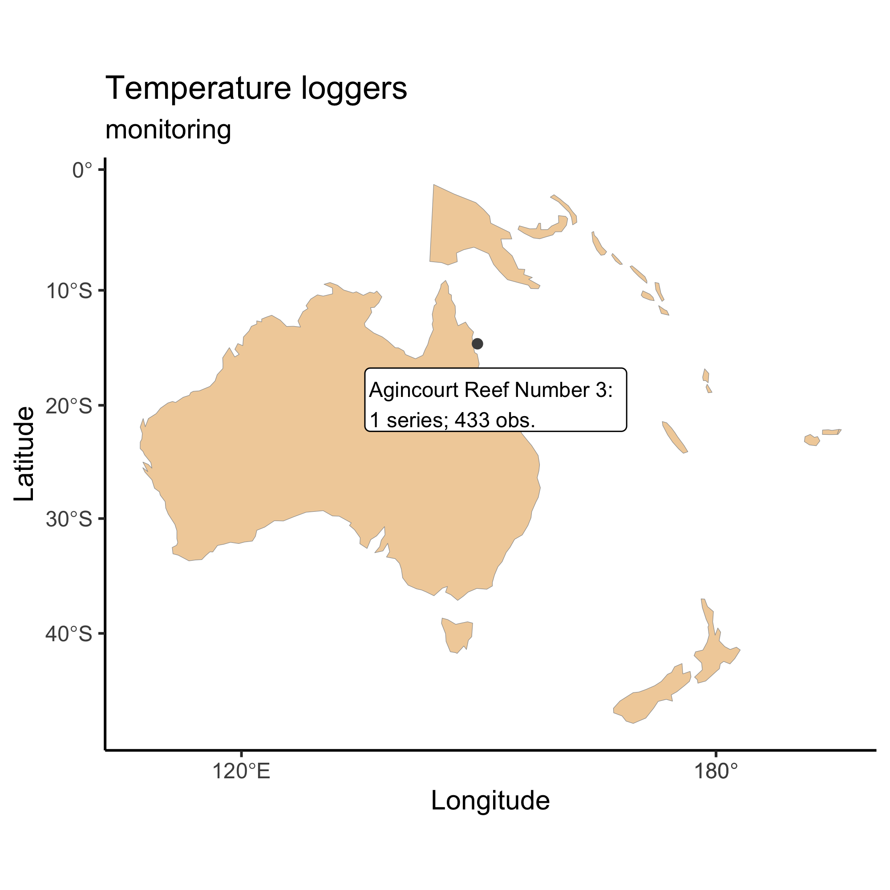
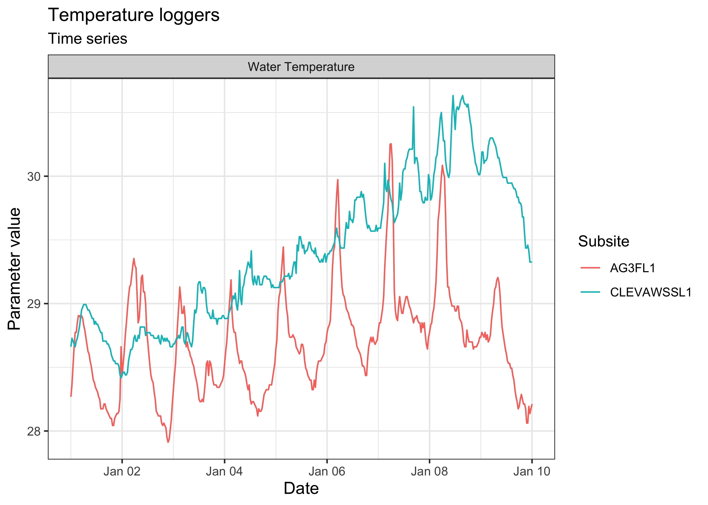
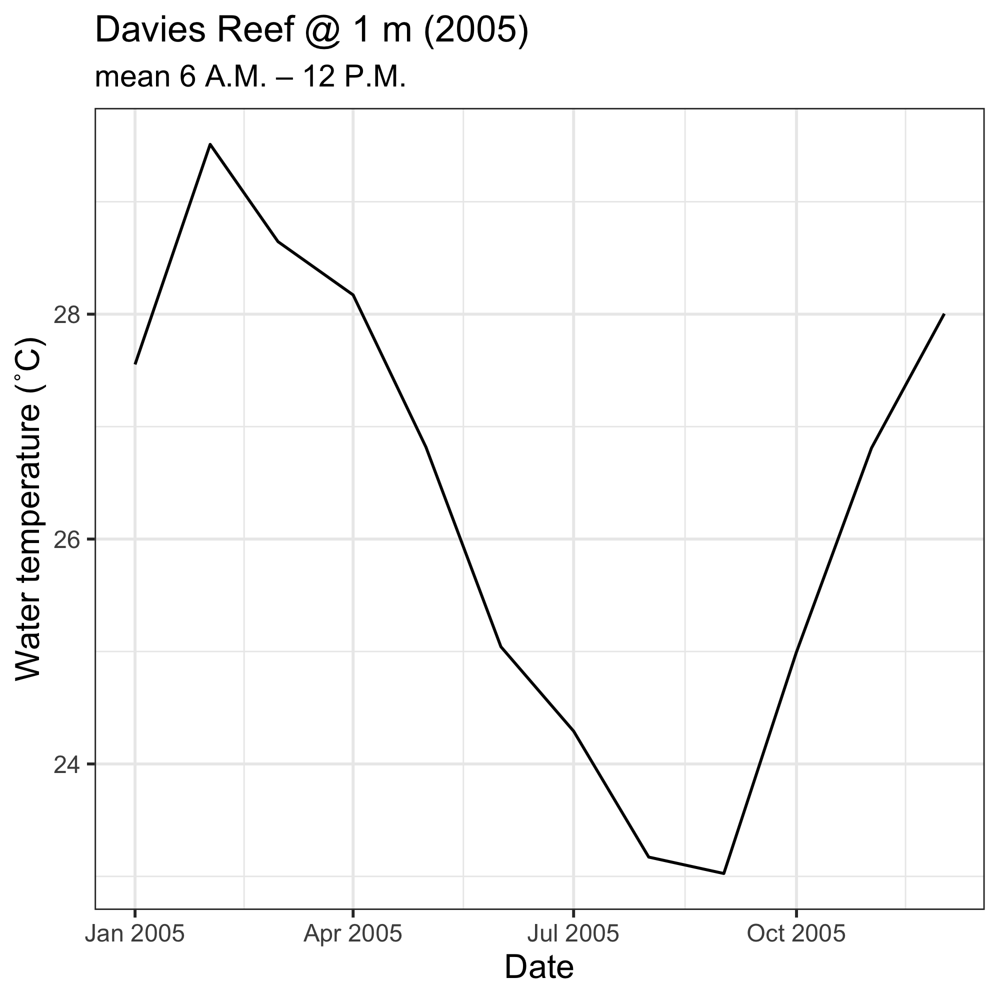
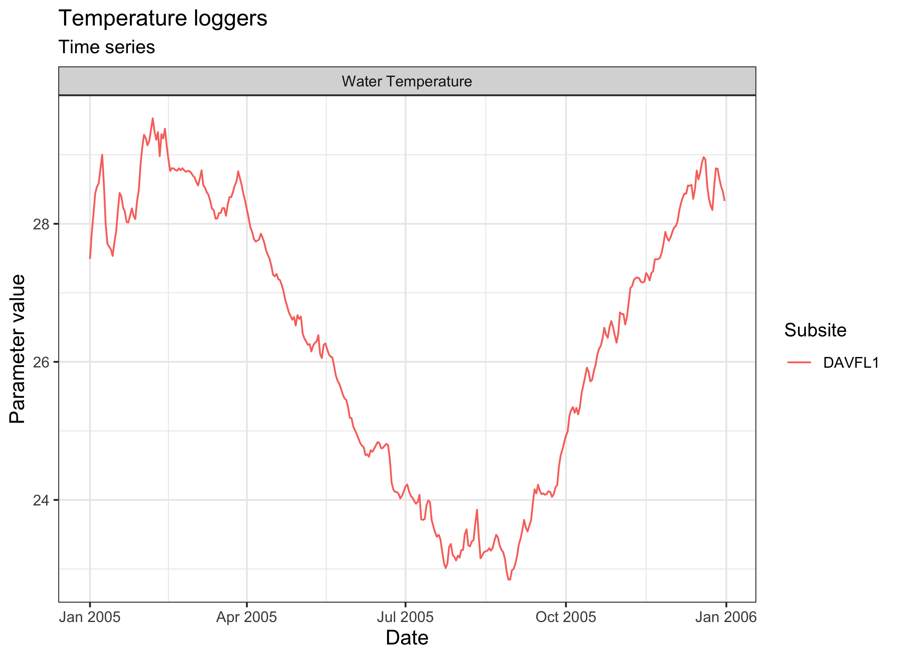

Please check our [intro vignette][1] first to implement the installation
requirements, and to learn the general approach to navigating the different
datasets. This vignette assumes you have obtained an
[AIMS Data Platform API Key][2].

[1]: https://ropensci.github.io/dataaimsr/articles/navigating.html
[2]: https://open-aims.github.io/data-platform/key-request

As per the installation instructions, we strongly suggest that you hide your
API Key permanently in your `.Renviron` file and set the object `my_api_key` to
`NULL` in the chunk below. You can read more about why that is important
[here](https://CRAN.R-project.org/package=httr/vignettes/secrets.html).


```r
# set my_api_key to NULL after successfully placing it in .Renviron
my_api_key <- NULL
```

Let's start by loading the packages needed for this vignette:


```r
library(purrr)
library(dataaimsr)
library(ggplot2)
```

## Discovering the dataset

The [Sea Water Temperature Loggers][3] dataset is less extensive than the
[AIMS Weather Station][4] dataset because it comprises one single
*"parameter"*---water temperature---that is measured at multiple sites. Not 
all sites have the same temporal coverage; some loggers are still actively 
collecting data, others have been discontinued. So the key distinctive 
variables in this instance are the "site", and the "series". A "series" 
represents a continuing time-series, i.e. a collection of deployments 
measuring the same parameter at the same subsite. Because there is only one
parameter (water temperature), subsite and series are synonymous in the
[Sea Water Temperature Loggers][3] dataset. So a series will comprise a
continuing time-series at a specific site and depth.

Essentially, for the user who has limited knowledge about where the data are,
and of what they are consisted, they would need to do some prior exploration 
to learn more about what can be downloaded. Suppose the goal is to download all
time-series from a particular site. The general procedure would be:

1. Examine documentation and establish query filters
2. Perform data download using `aims_data`
3. Create an exploratory time-series chart

For all datasets, a list of available filters can be retrieved with the 
function `aims_expose_attributes`. Knowing the filters is important because
some time series are quite extensive, with parameters being measured at very
high frequency (e.g. every 5 minutes), so downloading the dataset for an
entire year or more my take quite some time (it's possible though if that is
the true goal of the user). Otherwise, the Sea Water Temperature Loggers dataset
can be downloaded at daily average aggregations, which can reduce the size of
the download by many fold.


```r
aims_expose_attributes("temp_loggers")
#> $summary
#> [1] "summary-by-series"     "summary-by-deployment" "daily"                
#> 
#> $filters
#>  [1] "site"      "subsite"   "series"    "series_id" "parameter" "size"      "min_lat"  
#>  [8] "max_lat"   "min_lon"   "max_lon"   "from_date" "thru_date" "version"   "cursor"
```

In the [Sea Water Temperature Loggers][3] dataset, as demonstrated in our
[intro vignette][1], we have a convenience `summary` argument which facilitates 
learning more about what data is available. We can download the summary 
information for all sites using the main function called `aims_data`:

[3]: https://doi.org/10.25845/5b4eb0f9bb848
[4]: https://doi.org/10.25845/5c09bf93f315d


```r
sdata <- aims_data("temp_loggers", api_key = my_api_key,
                   summary = "summary-by-series")
head(sdata)
#>   site_id                    site subsite_id    subsite series_id     series
#> 1       1 Agincourt Reef Number 3       2687     AG3FL1      2687     AG3FL1
#> 2       1 Agincourt Reef Number 3      14276  AG3SL1old     14276  AG3SL1old
#> 3       3           Cleveland Bay       3007 CLEVAWSSL1      3007 CLEVAWSSL1
#> 4       3           Cleveland Bay       3069 CLEVAWSFL1      3069 CLEVAWSFL1
#> 5       4             Davies Reef       2629     DAVFL1      2629     DAVFL1
#> 6       4             Davies Reef       2630     DAVSL1      2630     DAVSL1
#>           parameter parameter_id time_coverage_start time_coverage_end      lat      lon
#> 1 Water Temperature            1          1996-03-30        2008-12-11 -15.9903 145.8212
#> 2 Water Temperature            1          1996-03-30        2011-07-21 -15.9905 145.8213
#> 3 Water Temperature            1          2004-05-13        2008-05-03 -19.1557 146.8813
#> 4 Water Temperature            1          2005-09-15        2005-12-22 -19.1557 146.8813
#> 5 Water Temperature            1          1997-08-26        2019-06-10 -18.8065 147.6688
#> 6 Water Temperature            1          1996-05-02        2021-03-29 -18.8060 147.6686
#>   depth uncal_obs cal_obs qc_obs
#> 1     0     23130  110480 110480
#> 2     5    114450  216794 216794
#> 3     7     11951   53231  53231
#> 4     1         0    4656   4656
#> 5     1    437544  566585 566585
#> 6     8    463146  589492 589437
```

`summary` should be set to either `summary-by-series` or `summary-by-deployment`
when the user wants an overview of the available data.


```r
ddata <- aims_data("temp_loggers", api_key = my_api_key,
                   summary = "summary-by-deployment")
head(ddata)
#>   deployment_id serial_num site_id             site subsite_id subsite series_id  series
#> 1          2616 SST-905084     860 Black Rocks Reef       2616  BLAFL1      2616  BLAFL1
#> 2          2612 SST-905053     856       Cattle Bay       2612   CBFL2      2612   CBFL2
#> 3          2613 SST-905054     857     Raine Island       2613 RAIDSL1      2613 RAIDSL1
#> 4          2620 SST-905189     863       Kelso Reef       2620  KELSL1      2620  KELSL1
#> 5          2619 SST-905091     863       Kelso Reef       2619  KELFL1      2619  KELFL1
#> 6          2621 SST-905068     865    Hayman Island       2621  HAYFL1      2621  HAYFL1
#>           parameter parameter_id time_coverage_start time_coverage_end      lat      lon
#> 1 Water Temperature            1          1996-07-20        1997-01-19 -16.2445 145.4872
#> 2 Water Temperature            1          1998-11-19        1999-03-02 -18.5719 146.4833
#> 3 Water Temperature            1          1996-11-28        1997-10-09 -11.5898 144.0309
#> 4 Water Temperature            1          1997-08-25        1998-04-18 -18.4221 146.9846
#> 5 Water Temperature            1          1997-08-25        1998-04-18 -18.4448 146.9933
#> 6 Water Temperature            1          1997-05-12        1998-04-21 -20.0413 148.8819
#>   depth uncal_obs cal_obs qc_obs
#> 1   0.1      8728    8728   8728
#> 2   4.0      4896    4896   4896
#> 3  20.0         0   15062  15062
#> 4   7.0     11278   11278  11278
#> 5   2.0     11278   11278  11278
#> 6   2.0     16460   16460  16460
```

Notice that `sdata` contains a lot of information, most of which is
related to site / series / parameter ID. Each row corresponds to a
unique series. The columns `time_coverage_start` and `time_coverage_end` are
probably one of the most valuable pieces of information. They provide the user
with the window of data collection for a particular series, which is probably
crucial to decide whether that particular series is of relevance to the
specific question in hand.

The benefits to choosing a data `series` (or the numeric equivalent,
`series_id`) is that it comes from one location and parameter type (here only
water temperature), making the data easy to plot. If we did not choose a
data series from the [Sea Water Temperature Loggers][4] dataset, we would have
to specify additional arguments to ensure the data is downloaded as expected.

Our values and filters might look like the following:

Variable  | Value                  | Description
----------|------------------------|-------------------------------------------------------
series_id | 2687                   | Found [here][6], Agincourt Reef Number 3
from_date | "2005-01-01"           | We want to start charting on 1/1/2005
thru_date | "2005-01-10"           | We are plotting 10 days of data

[5]: https://open-aims.github.io/data-platform
[6]: https://apps.aims.gov.au/metadata/view/4a12a8c0-c573-11dc-b99b-00008a07204e

## Query and Plot Dataset

After deciding on query parameters, we plug the series id into a `aims_data` function:


```r
agincourt <- aims_data("temp_loggers", api_key = my_api_key,
                       filters = list(series_id = 2687,
                                      from_date = "2005-01-01",
                                      thru_date = "2005-01-10"))
```

We can check that the query filters worked:


```r
range(agincourt$time)
#> [1] "2005-01-01 UTC" "2005-01-10 UTC"
```

We can then visualise where in Australia that data is placed:


```r
plot(agincourt, ptype = "map")
```



We can also visually compare multiple series at once. For instance, let's
compare the air temperature data from Davies Reef and Bramble Cay for the
same period of time:


```r
target_series <- c("Agincourt" = 2687, "Cleveland Bay" = 3007)
aims_data_per_series <- function(series_number, my_api_key, ...) {
  aims_data("temp_loggers", api_key = my_api_key,
            filters = list(series_id = series_number, ...))
}
results <- purrr::map(target_series, aims_data_per_series,
                      my_api_key = my_api_key,
                      from_date = "2005-01-01",
                      thru_date = "2005-01-10")
sst_data <- purrr::map_dfr(results, rbind)
plot(sst_data, ptype = "time_series")
```



One could also download data for a particular time of day throughout
the year, e.g. for Davies Reef at 1 m of depth (`series_id` is 2629):


```r
days <- seq(as.Date("2005-01-01"), as.Date("2005-12-31"), by = "month")
out <- numeric(length = length(days))
for (i in seq_along(days)) {
  hour_in <- paste0(days[i], "T06:00:00")
  hour_out <- paste0(days[i], "T12:00:00")
  df <- aims_data("temp_loggers", api_key = my_api_key,
                  filters = list(series_id = 2629, from_date = hour_in,
                                 thru_date = hour_out))
  out[i] <- mean(df$qc_val)
}

ggplot(data = data.frame(date = days, temps = out)) +
  geom_line(mapping = aes(x = date, y = temps)) +
  labs(x = "Date",
       y = "Water temperature (˚C)",
       title = "Davies Reef @ 1 m (2005)",
       subtitle = "mean 6 A.M. – 12 P.M.") +
  theme_bw() +
  theme(axis.title.x = element_text(size = 12),
        axis.title.y = element_text(size = 12),
        legend.position = "bottom")
```



Or simply plot the daily aggregated averages:


```r
df <- aims_data("temp_loggers", api_key = my_api_key, summary = "daily",
                filters = list(series_id = 2629, from_date = "2005-01-01",
                               thru_date = "2005-12-31"))
plot(df, ptype = "time_series", pars = c("Water Temperature"))
```



## Bibliography


```r
purrr::map_chr(results, aims_citation) %>%
  unlist %>%
  unname
#> [1] "Australian Institute of Marine Science (AIMS). 2017, AIMS Sea Temperature Observing System (AIMS Temperature Logger Program), Time period:2005-01-01 to 2005-01-10. https://doi.org/10.25845/5b4eb0f9bb848, accessed 29 Oct 2021."
#> [2] "Australian Institute of Marine Science (AIMS). 2017, AIMS Sea Temperature Observing System (AIMS Temperature Logger Program), Time period:2005-01-01 to 2005-01-10. https://doi.org/10.25845/5b4eb0f9bb848, accessed 29 Oct 2021."
```
