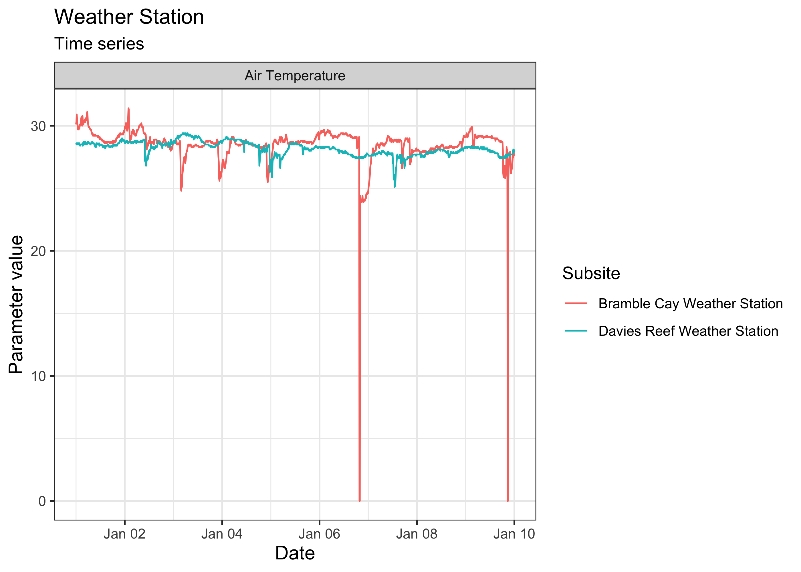
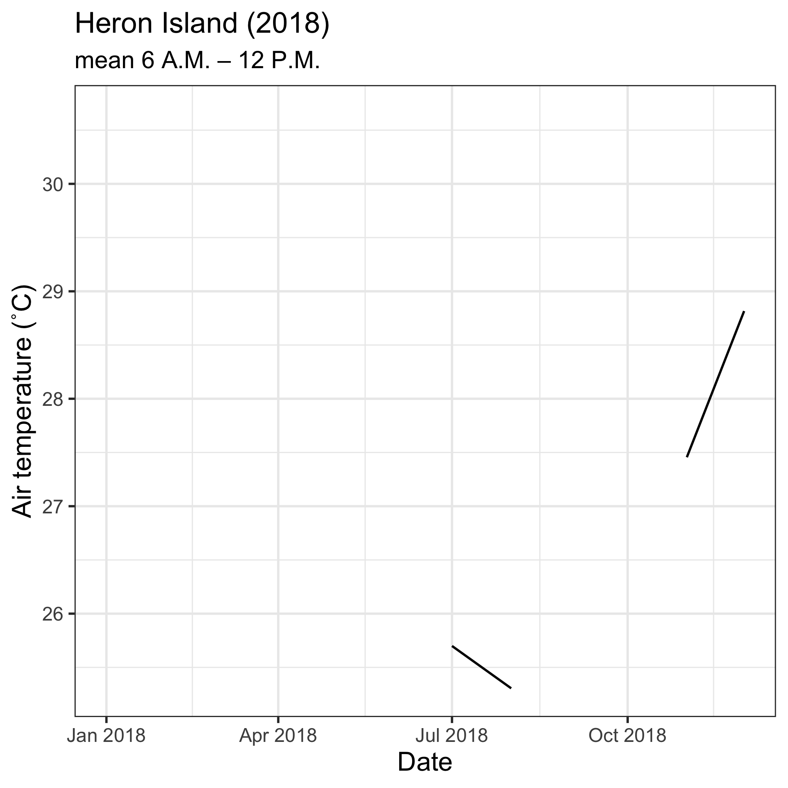

Please check our [intro vignette][1] first to implement the installation
requirements, and to learn the general approach to navigating the different
datasets. This vignette assumes you have obtained an
[AIMS Data Platform API Key][2].

[1]: https://ropensci.github.io/dataaimsr/articles/navigating.html
[2]: https://open-aims.github.io/data-platform/key-request

As per the installation instructions, we strongly suggest that you hide your
API Key permanently in your `.Renviron` file and set the object `my_api_key` to
`NULL` in the chunk below. You can read more about why that is important
[here](https://CRAN.R-project.org/package=httr/vignettes/secrets.html).


```r
# set my_api_key to NULL after successfully placing it in .Renviron
my_api_key <- NULL
```

Let's start by loading the packages needed for this vignette:


```r
library(purrr)
library(dataaimsr)
library(ggplot2)
```

## Discover a dataset

The [AIMS Weather Station][3] dataset consists of a series of *"parameters"* 
that are measured at multiple sites. Those could be, for instance, minimum 
wind speed, peak wave period, wind direction, water pressure, dissolved 
oxygen, chlorophyll concentration, etc. Not all parameters are measured for 
all sites and at all times. Some loggers are still actively collecting data, 
others have been discontinued.

Essentially, for the user who has limited knowledge about where the data are,
and of what they are consisted, they would need to do some prior exploration 
to learn more about what can downloaded. Suppose the goal is to download all
time-series from a particular site. The general procedure would be:

1. Examine documentation and establish query filters
2. Perform data download using `aims_data`
3. Use the R package `ggplot2` to create an exploratory time-series chart

For all datasets, a list of available filters can be retrieved with the 
function `aims_expose_attributes`. Knowing the filters is important because
some time series are quite extensive, with parameters being measured at very
high frequency (e.g. every 5 minutes), so downloading the dataset for an
entire year or more my take quite some time (it's possible though if that is
the true goal of the user).


```r
aims_expose_attributes("weather")
#> $summary
#> [1] NA
#> 
#> $filters
#>  [1] "site"      "subsite"   "series"    "series_id" "parameter" "size"      "min_lat"  
#>  [8] "max_lat"   "min_lon"   "max_lon"   "from_date" "thru_date" "version"   "cursor"
```

In the [Sea Water Temperature Loggers][4] dataset, as demonstrated in our
[intro vignette][1], we have a convenience `summary` method which facilitates
learning more about what data is available, or downloading daily aggregated
average data. The back-end for these is currently
being developed for the AIMS Weather Station as well. In the meantime, to
explore the [AIMS Weather Station][3] dataset, we use the function
`aims_filter_values`. This function takes a target dataset and a given filter,
and returns all the available information regarding the filter. We recommend
exploring the `series` filter---a series is a continuing time-series, i.e. a
collection of deployments measuring the same parameter (e.g. air temperature,
air pressure, chlorophyll) at the same subsite. So, for a given site and
parameter, there might exist multiple subsites and therefore series, in which
case they are most likely distinguishable by depth.

[3]: https://doi.org/10.25845/5c09bf93f315d
[4]: https://doi.org/10.25845/5b4eb0f9bb848


```r
head(aims_filter_values("weather", filter_name = "series"))
#>   series_id                                                                 series
#> 1    104918        Myrmidon Reef Weather Station Wind Speed (scalar avg b 10 min) 
#> 2    100686                            Saibai Island Weather Station Hail Duration
#> 3       266 Orpheus Island Relay Pole 3 Wind Direction (Vector Average 30 Minutes)
#> 4      2639 Hardy Reef Weather Station Wind Direction (Vector Standard 10 Minutes)
#> 5     10243                           Raine Island Weather Station Air Temperature
#> 6       258             Orpheus Island Relay Pole 3 Wind Speed (Scalar avg 10 min)
```

The benefits to choosing a data `series` is that it comes from one location
and parameter type, making the data easy to plot. If we did not choose a
data series from the [AIMS Weather Station][3] dataset, we would have to 
specify additional arguments to ensure the data is downloaded as expected.

Our values and filters might look like the following:

Variable  | Value                  | Description
----------|------------------------|-------------------------------------------------------
series_id | 64                     | Found [here][6], Davies Reef Air Temperature data series
from_date | "2018-01-01"           | We want to start charting on 1/1/2018
thru_date | "2018-01-10"           | We are plotting 10 days of data

[5]: https://open-aims.github.io/data-platform
[6]: https://apps.aims.gov.au/metadata/view/5fc91100-4ade-11dc-8f56-00008a07204e

## Query and Plot Dataset

After deciding on query parameters, we plug the series id into a `aims_data` function:


```r
davies <- aims_data("weather", api_key = my_api_key,
                    filters = list(series_id = 64,
                                   from_date = "2018-01-01",
                                   thru_date = "2018-01-10"))
```

We can even visually compare multiple series at once. For instance, let's
compare the air temperature data from Davies Reef and Bramble Cay for the
same period of time:


```r
target_series <- c("Davies Reef" = 64, "Bramble Cay" = 87929)
aims_data_per_series <- function(series_number, my_api_key, ...) {
  aims_data("weather", api_key = my_api_key,
            filters = list(series_id = series_number, ...))
}
results <- purrr::map(target_series, aims_data_per_series,
                      my_api_key = my_api_key,
                      from_date = "2018-01-01",
                      thru_date = "2018-01-10")
weather_data <- purrr::map_dfr(results, rbind)
plot(weather_data, ptype = "time_series")
```



One could also download data for a particular time of day throughout
the year, e.g. for Heron Island Relay Pole 8 at 5.4 m of depth (series
10394):


```r
days <- seq(as.Date("2018-01-01"), as.Date("2018-12-31"), by = "month")
out <- numeric(length = length(days))
for (i in seq_along(days)) {
  hour_in <- paste0(days[i], "T06:00:00")
  hour_out <- paste0(days[i], "T12:00:00")
  df <- aims_data("weather",
                  api_key = my_api_key,
                  filters = list(series_id = 10394,
                                 from_date = hour_in,
                                 thru_date = hour_out))
  out[i] <- mean(df$qc_val)
}
ggplot(data = data.frame(date = days, temps = out)) +
  geom_line(mapping = aes(x = date, y = temps)) +
  labs(x = "Date",
       y = "Air temperature (˚C)",
       title = "Heron Island (2018)",
       subtitle = "mean 6 A.M. – 12 P.M.") +
  theme_bw() +
  theme(axis.title.x = element_text(size = 12),
        axis.title.y = element_text(size = 12),
        legend.position = "bottom")
```



## Bibliography


```r
purrr::map_chr(results, aims_citation) %>%
  unlist %>%
  unname
#> [1] "Australian Institute of Marine Science (AIMS). 2009, Australian Institute of Marine Science Automatic Weather Stations, https://doi.org/10.25845/5c09bf93f315d, accessed 29 October 2021.  Time period: 2018-01-01 to 2018-01-10.  Series: Davies Reef Weather Station Air Temperature"
#> [2] "Australian Institute of Marine Science (AIMS). 2009, Australian Institute of Marine Science Automatic Weather Stations, https://doi.org/10.25845/5c09bf93f315d, accessed 29 October 2021.  Time period: 2018-01-01 to 2018-01-10.  Series: Bramble Cay Weather Station Air Temperature"
```
